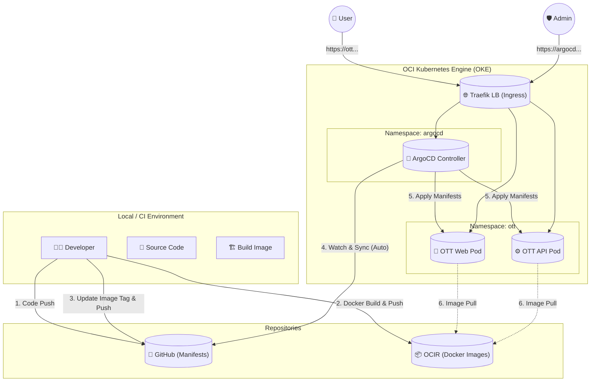

# 📝 OKE GitOps 구축 및 운영 가이드

## 1. 진행 내역 요약

사용자님의 **OCI Free Tier** 환경을 고려하여 비용 효율적이고 자동화된 배포 시스템을 구축했습니다.

*   **ArgoCD 설치:** Kubernetes 클러스터 내에 CD(Continuous Deployment) 도구인 ArgoCD를 설치했습니다.
*   **Git 저장소 연결:** Private GitHub 저장소(`chawon/ott`)와 ArgoCD를 SSH Key로 안전하게 연결했습니다.
*   **Application 생성:** `ott-app`을 생성하여 `deploy/oke` 폴더의 매니페스트(Web, API)를 `ott` 네임스페이스에 자동 동기화하도록 설정했습니다.
*   **비용 최적화 (Load Balancer 통합):**
    *   ArgoCD용 별도 Load Balancer를 제거했습니다. (Free Tier 제한 준수)
    *   기존 사용 중인 **Traefik Ingress**를 통해 ArgoCD에 접속하도록 설정했습니다.
*   **접속 환경 구성:** `argocd.preview.pe.kr` 도메인으로 접속하도록 Ingress 라우팅을 설정했습니다.

---

## 2. CD (지속적 배포) 아키텍처 흐름도



---

## 3. 구체적인 운영 가이드

### A. 새로운 버전 배포 방법 (Routine Deployment)

기능을 개발하고 배포하는 표준 절차입니다.

1.  **이미지 빌드 및 푸시:**
    *   로컬 개발 환경에서 코드를 수정합니다.
    *   Docker 이미지를 빌드하고 OCIR에 푸시합니다.
    ```bash
    # 예시
    docker build -t yny.ocir.io/axvqyylkrvmi/ott-api:v2.0 .
    docker push yny.ocir.io/axvqyylkrvmi/ott-api:v2.0
    ```

2.  **Manifest 업데이트 (Git):**
    *   `workspace/ott/deploy/oke` 폴더 내의 Deployment 파일(`api-deployment.yaml` 등)을 엽니다.
    *   `image` 태그를 방금 푸시한 버전(`:v2.0`)으로 수정합니다.
    *   변경 사항을 GitHub에 커밋하고 푸시합니다.
    ```bash
    git add deploy/oke/api-deployment.yaml
    git commit -m "chore: update api image to v2.0"
    git push origin main
    ```

3.  **배포 자동화 (ArgoCD):**
    *   ArgoCD는 GitHub의 변경 사항을 감지하고(약 3분 주기), OKE 클러스터의 상태를 Git 정의와 일치시킵니다 (`Self Healing`).
    *   즉시 배포를 원하면 ArgoCD 대시보드에서 **[Refresh]** -> **[Sync]** 버튼을 누르면 됩니다.

### B. 환경 설정 변경 (Config/Secret)

1.  **ConfigMap 변경:**
    *   `web-config.yaml` 등의 내용을 수정하고 Git에 푸시하면, ArgoCD가 이를 반영합니다.
    *   단, 파드는 ConfigMap 변경 시 자동으로 재시작되지 않을 수 있습니다. 확실한 적용을 위해 파드를 재생성하거나 Deployment 업데이트 전략을 사용하세요.

2.  **Secret 관리 (주의):**
    *   `api-secret.yaml` 등 민감 정보가 담긴 파일은 Git에 평문으로 올리지 않는 것이 좋습니다.
    *   현재는 로컬에서 `kubectl apply`로 관리하거나, Git에는 암호화된 값(Sealed Secrets 등)을 올리는 방식을 고려해야 합니다. 현재 설정에서는 GitHub에 있는 Secret 파일이 그대로 클러스터에 적용됩니다.

### C. ArgoCD 접속 및 모니터링

*   **주소:** `https://argocd.preview.pe.kr`
*   **계정:** `admin`
*   **초기 비밀번호:** `FZU-8L2G9Thq2nUC`
    *   *보안 권장사항:* 로그인 후 `User Info` 메뉴에서 비밀번호를 변경하는 것을 권장합니다.

### D. 문제 발생 시 롤백 (Rollback)

ArgoCD는 **Git을 진실의 원천(Source of Truth)**으로 여깁니다.

*   **올바른 롤백 방법:** Git에서 문제가 발생하기 전의 커밋으로 되돌린 후(`git revert`), 다시 푸시합니다. ArgoCD가 이를 감지하여 클러스터 상태를 과거의 안정적인 상태로 되돌립니다.
*   *주의:* ArgoCD UI에서 'Rollback' 버튼을 누를 수 있지만, Git에 새로운 커밋이 발생하면 다시 덮어씌워집니다. 항상 Git을 수정하는 습관을 들이세요.
