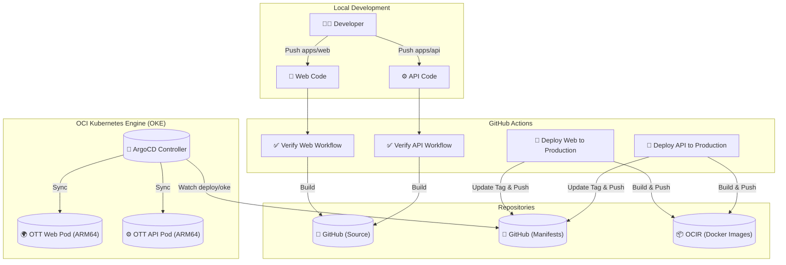

# 📝 OKE GitOps 구축 및 운영 가이드

## 1. 시스템 개요

이 프로젝트는 **Oracle Cloud Infrastructure (OCI) Kubernetes Engine (OKE)** 환경에서 운영되며, **ArgoCD**를 통한 **GitOps** 방식으로 배포를 자동화하고 있습니다.

### 주요 특징
*   **GitOps:** GitHub 저장소의 `deploy/oke` 폴더가 진실의 원천(Source of Truth)입니다. ArgoCD가 이 폴더를 감지하여 클러스터 상태를 동기화합니다.
*   **분리 배포 (Split Deployment):** Web(`apps/web`)과 API(`apps/api`)는 서로 다른 GitHub Actions 워크플로우를 통해 독립적으로 검증되고 수동 배포됩니다.
*   **ARM64 지원:** OKE의 Ampere A1 (ARM64) 노드에서 실행되도록 `linux/arm64` 아키텍처로 도커 이미지를 빌드합니다. GitHub Actions는 **ARM64 호스티드 러너(ubuntu-24.04-arm)** 를 사용합니다.
*   **비용 최적화:** ArgoCD 전용 Load Balancer 없이 기존 Traefik Ingress를 통해 통합 접속(`argocd.preview.pe.kr`)합니다.

---

## 2. CI/CD 아키텍처 흐름도

```mermaid
graph TD
    subgraph "Local Development"
        Dev[👨‍💻 Developer]
        CodeWeb[📝 Web Code]
        CodeAPI[⚙️ API Code]
    end

	    subgraph "GitHub Actions"
	        VerifyWeb[✅ Verify Web Workflow]
	        VerifyAPI[✅ Verify API Workflow]
	        DeployWeb[🚀 Deploy Web to Production]
	        DeployAPI[🚀 Deploy API to Production]
    end

    subgraph "Repositories"
        GitSource[("🐙 GitHub (Source)")]
        GitManifest[("🐙 GitHub (Manifests)")]
        OCIR[("📦 OCIR (Docker Images)")]
    end

    subgraph "OCI Kubernetes Engine (OKE)"
        ArgoCD[("🐙 ArgoCD Controller")]
        PodWeb[("🌍 OTT Web Pod (ARM64)")]
        PodAPI[("⚙️ OTT API Pod (ARM64)")]
    end

    %% Flow
    Dev -->|Push apps/web| CodeWeb
    Dev -->|Push apps/api| CodeAPI

    CodeWeb --> VerifyWeb
    CodeAPI --> VerifyAPI

    VerifyWeb -->|Build| GitSource
    VerifyAPI -->|Build| GitSource

    DeployWeb -->|Build & Push| OCIR
    DeployWeb -->|Update Tag & Push| GitManifest

    DeployAPI -->|Build & Push| OCIR
    DeployAPI -->|Update Tag & Push| GitManifest

    ArgoCD -- "Watch deploy/oke" --> GitManifest
    ArgoCD -- "Sync" --> PodWeb & PodAPI
```

---

## 3. GitHub Actions 워크플로우

검증과 프로덕션 배포 워크플로우를 분리한다.

1.  **`deploy-web.yml`**:
    *   **트리거:** PR, main push, 수동 실행.
    *   **동작:** Next.js build -> Dockerfile 빌드 검증 (`linux/arm64`).
    *   **러너:** `ubuntu-24.04-arm` (ARM64 호스티드 러너)
    *   **주의:** OCIR push와 Kubernetes manifest 갱신은 하지 않는다.

2.  **`deploy-api.yml`**:
    *   **트리거:** PR, main push, 수동 실행.
    *   **동작:** Gradle build -> Dockerfile 빌드 검증 (`linux/arm64`).
    *   **러너:** `ubuntu-24.04-arm` (ARM64 호스티드 러너)
    *   **주의:** OCIR push와 Kubernetes manifest 갱신은 하지 않는다.

3.  **`deploy-web-production.yml`** / **`deploy-api-production.yml`**:
    *   **트리거:** `workflow_dispatch`.
    *   **입력:** CI 검증이 끝난 main 커밋 SHA.
    *   **동작:** production 이미지 빌드 및 OCIR push -> `deploy/oke/{web,api}-deployment.yaml` 태그 업데이트 -> Git Push.

> **주의:** `deploy/` 폴더 내의 파일 수정은 CI를 트리거하지 않도록 설정되어 있습니다 (`paths-ignore` 효과). 이는 무한 배포 루프를 방지하기 위함입니다.

---

## 4. 운영 가이드

### A. 새로운 버전 배포 방법 (Routine Deployment)

main 머지는 클러스터에 자동 배포되지 않는다. 프로덕션 반영은 수동 workflow로 수행한다.

1.  **코드 수정:** `apps/web` 또는 `apps/api` 코드를 수정합니다.
2.  **PR/CI 검증:** `deploy-web.yml` / `deploy-api.yml`이 빌드와 Dockerfile 검증을 수행합니다.
3.  **main 머지:** 검증된 변경을 main에 병합합니다.
4.  **수동 배포:** GitHub Actions에서 **Deploy Web/API to Production**을 실행하고 main SHA를 입력합니다.
5.  **GitOps 적용:** workflow가 `deploy/oke/*.yaml`의 이미지 태그를 갱신하면 ArgoCD가 production 파드를 교체합니다.

### B. 환경 설정 변경 (Config/Secret)

1.  **Secret 변경 (OCI Vault + ESO):**
    *   API 서버의 시크릿은 **OCI Vault**에서 관리되며, **External Secrets Operator(ESO)**가 주기적으로 동기화합니다.
    *   시크릿 값 변경 시: OCI Console 또는 OCI CLI에서 해당 시크릿을 업데이트하면 ESO가 최대 1시간 내 자동 반영합니다.
    *   즉시 반영이 필요한 경우: `kubectl annotate externalsecret ott-api-secrets -n ott force-sync=$(date +%s) --overwrite`
    *   비밀이 아닌 설정값(`TELEGRAM_NOTIFY_ENABLED`, `TELEGRAM_SERVICE_NAME`, `CF_REQUEST_HOST`)은 `deploy/oke/api-deployment.yaml`에 직접 env로 관리합니다.
    *   **ESO 관련 파일:** `deploy/oke/external-secret.yaml` (SecretStore + ExternalSecret)

2.  **ConfigMap 변경:**
    *   `deploy/oke/web-config.yaml`을 수정하고 푸시하면 ArgoCD가 반영합니다.

### C. 문제 발생 시 대응

*   **검증 실패 (GitHub Actions):** Actions 탭에서 로그를 확인합니다. Web/API build와 Dockerfile build 중 어디서 실패했는지 먼저 분리하세요.
*   **배포 실패 (Production workflows):** Docker push 또는 manifest 갱신 단계의 실패 여부를 확인합니다.
*   **Git Push 충돌:** Web과 API production workflow가 동시에 배포될 경우 manifest push 단계에서 충돌이 날 수 있습니다. 워크플로우에는 `git pull --rebase` 로직이 포함되어 있어 자동으로 해결을 시도합니다.
*   **파드 에러 (CrashLoopBackOff):** `kubectl logs -n ott <pod-name>`으로 로그를 확인하세요. DB 연결 정보나 환경 변수 문제일 수 있습니다.
*   **롤백 (Rollback):**
    *   GitHub에서 문제가 발생하기 전의 커밋으로 `git revert` 합니다.
    *   ArgoCD가 과거 버전의 이미지 태그로 Manifest를 되돌리고, 클러스터도 롤백됩니다.
    *   *참고:* Deployment 설정에 `revisionHistoryLimit: 3`이 적용되어 있어, 클러스터 내에는 최근 3개의 버전만 기록으로 남습니다.

### D. 접속 정보

*   **서비스 주소:** `https://ottline.app`
*   **ArgoCD 대시보드:** `https://argocd.preview.pe.kr`
    *   계정 정보는 Kubernetes secret 또는 운영 비밀번호 관리자에서 확인합니다.
